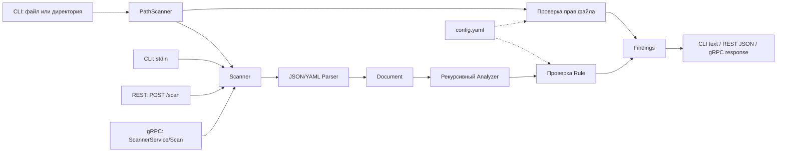

# Echelon Utility

`echelon-utility` - утилита на Go для поиска потенциально небезопасных настроек в конфигурационных файлах веб-приложений. Она принимает JSON или YAML, рекурсивно анализирует структуру документа и возвращает найденные проблемы с уровнем критичности, расположением в конфиге, описанием и рекомендацией.

Проект можно использовать тремя способами:
- как CLI для проверки файла, стандартного ввода или директории;
- как REST-сервис;
- как gRPC-сервис.

## Возможности

- разбор JSON, YAML и YML;
- рекурсивная проверка вложенных объектов и массивов;
- поиск ключей без учёта регистра;
- настройка правил через `config.yaml`;
- рекурсивный обход директории с конфигами;
- проверка прав доступа к файлам;
- текстовый вывод для CLI и структурированные ответы REST/gRPC;
- флаг `-s` / `--silent`, позволяющий не возвращать ошибку при наличии обычных находок.

## Проверяемые настройки

| Проверка | Уровень по умолчанию | Пример небезопасного значения |
|---|---|---|
| Подробное логирование | `LOW` | `level: debug` или `trace` |
| Пароль в открытом виде | `HIGH` | ключ `password`, `passwd`, `pwd` или `db_password` |
| Публичный адрес | `MEDIUM` | `host: 0.0.0.0` или `host: "::"` |
| Отключённая проверка TLS | `HIGH` | `tls: false` или `insecure: true` |
| Слабый алгоритм | `HIGH` | `MD5`, `SHA1` или `DES` |
| Небезопасные права файла | `MEDIUM` | право на запись для группы или остальных пользователей |

Набор ключей, небезопасных значений, уровни критичности и рекомендации задаются в [`cli/cmd/echelon-utility/config.yaml`](cli/cmd/echelon-utility/config.yaml).

## Как работает проект

1. CLI, REST или gRPC получает конфигурацию.
2. Парсер выбирается по расширению файла, `Content-Type` или содержимому входного потока.
3. JSON и YAML преобразуются в единое внутреннее представление `Document`.
4. Анализатор рекурсивно обходит объекты и массивы, формируя пути вида `server.tls` или `servers[0].host`.
5. Для каждого конечного значения выполняются включённые правила.
6. Найденные проблемы возвращаются вызывающему интерфейсу: текстом в CLI, JSON-ответом в REST или protobuf-ответом в gRPC.

При проверке файла или директории CLI дополнительно анализирует права доступа. REST, gRPC и ввод через `stdin` получают только содержимое конфигурации, поэтому проверить права исходного файла через них невозможно.



## Состав проекта

| Путь | Назначение                                                     |
|---|----------------------------------------------------------------|
| `cli/cmd/echelon-utility` | Точка входа CLI и конфигурация правил                          |
| `rest/cmd/echelon-rest` | Запуск HTTP-сервера                                            |
| `rest/server` | Обработчик `POST /scan`                                        |
| `grpc/cmd/echelon-grpc` | Запуск gRPC-сервера                                            |
| `grpc/server` | Реализация метода `ScannerService/Scan`                        |
| `grpc/api/echelon/v1` | Protobuf-контракт и сгенерированный Go-код                     |
| `internal/source` | Чтение файла или стандартного ввода                            |
| `internal/parser` | Выбор формата и разбор JSON/YAML                               |
| `internal/document` | Общее представление разобранного документа                     |
| `internal/analyzer` | Рекурсивный обход конфигурации                                 |
| `internal/rule` | Правила содержимого, правила файла и модель найденной проблемы |
| `internal/scanner` | Общий сервис проверки для всех интерфейсов                     |
| `internal/pathscanner` | Проверка отдельного файла или рекурсивный обход директории     |
| `internal/output` | Форматирование текстового результата CLI                       |
| `internal/config` | Загрузка настроек правил                                       |
| `testdata` | JSON/YAML-примеры и протокол ручных проверок                   |

## Требования

- Go `1.25`;
- Docker Compose для запуска REST и gRPC в контейнерах;
- `curl` и `jq` для ручной проверки REST;
- `grpcurl` и `jq` для ручной проверки gRPC.

Команды ниже следует выполнять из корня проекта.

## Быстрый запуск CLI
Примечание: запуск из корня проекта echelon-utility

Проверка одного файла:

```bash
go run ./cli/cmd/echelon-utility testdata/all-unsafe.yaml
```

Чтение из стандартного ввода:

```bash
go run ./cli/cmd/echelon-utility --stdin < testdata/stdin-json.txt
```

Рекурсивная проверка директории:

```bash
go run ./cli/cmd/echelon-utility testdata
```

По умолчанию CLI завершает работу с кодом `1`, если найдена хотя бы одна проблема. Флаг `-s` или `--silent` сохраняет вывод находок, но возвращает код `0`:

```bash
go run ./cli/cmd/echelon-utility --silent testdata/all-unsafe.json
```

`--silent` не подавляет ошибки чтения, парсинга и валидации. Поэтому проверка всей директории `testdata` возвращает код `1`: в ней специально находятся невалидные файлы для негативных сценариев.

## Запуск REST и gRPC

Оба сервиса можно собрать и запустить через Docker Compose:

```bash
docker-compose up --build -d
```

После запуска доступны:

- REST - `http://localhost:8080`;
- gRPC - `localhost:9090`.

Пример REST-запроса:

```bash
curl -sS \
  -X POST http://localhost:8080/scan \
  -H 'Content-Type: application/json' \
  --data-binary @testdata/all-unsafe.json | jq .
```

REST определяет формат по заголовку `Content-Type`. Поддерживаются `application/json`, `application/yaml`, `application/x-yaml` и `text/yaml`.

Метод gRPC:

```text
echelon.v1.ScannerService/Scan
```

Он принимает имя источника `source_name` и содержимое конфигурации `content`. Сервер можно вызывать через `grpcurl` без отдельного указания `.proto`-файла.

Остановить сервисы:

```bash
docker-compose down
```

## Формат результата

CLI выводит по одной найденной проблеме на строку:

```text
HIGH: [server.tls] Некорректная настройка TLS "tls":false. Включите TLS и проверку сертификата.
```

Основные поля найденной проблемы:

- `severity` - уровень критичности;
- `rule` - название сработавшего правила;
- `path` - путь к настройке внутри документа;
- `message` - описание проблемы;
- `recommendation` - рекомендацию по исправлению.

При проверке директории CLI также добавляет имя исходного файла к расположению найденной проблемы.

## Проверка проекта

Тестовые JSON/YAML-файлы, ожидаемые результаты и полный список команд для CLI, REST и gRPC находятся в [`testdata/TEST.md`](testdata/TEST.md).
